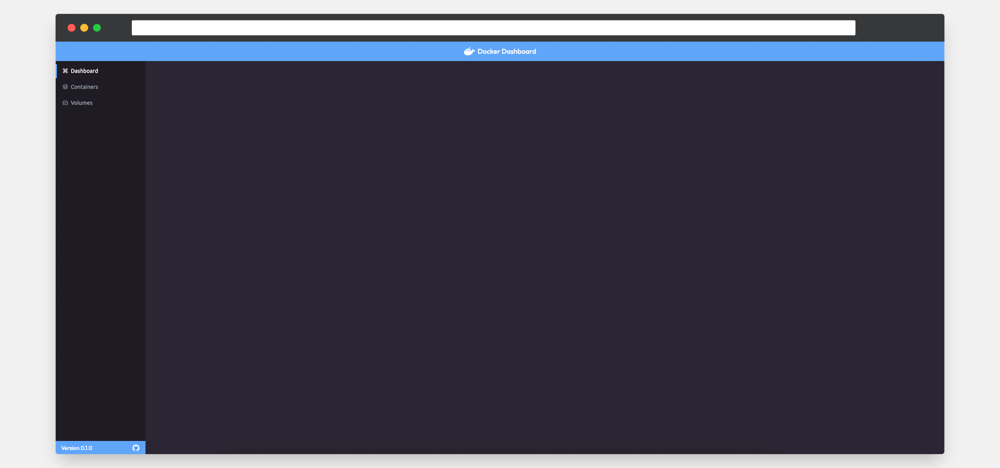

# Docker Dashboard

Sleek web based docker management tool.

### Development

#### Environment variables

Coming soon...

#### Running

```bash
# run production build
$ docker-compose up -d

# run production build (with rebuild in case of new changes)
$ docker-compose up -d --build

# view docker logs
$ docker-compose logs -t -f

# close docker process
$ docker-compose down
```
